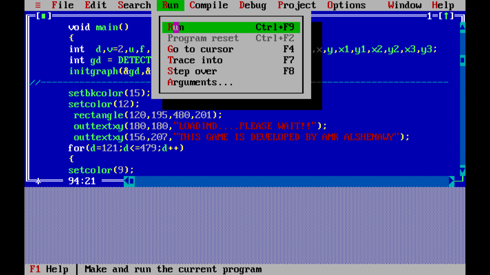
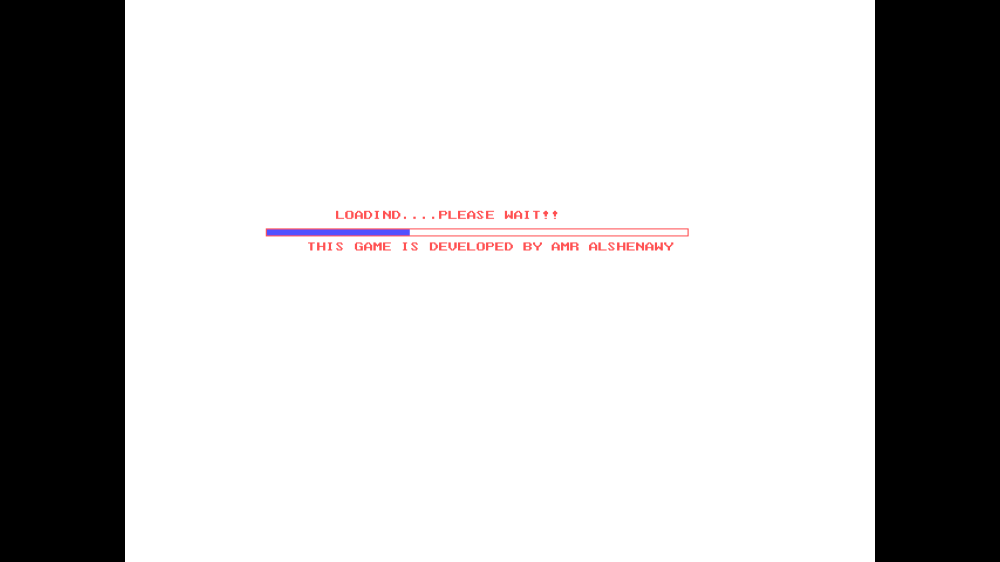
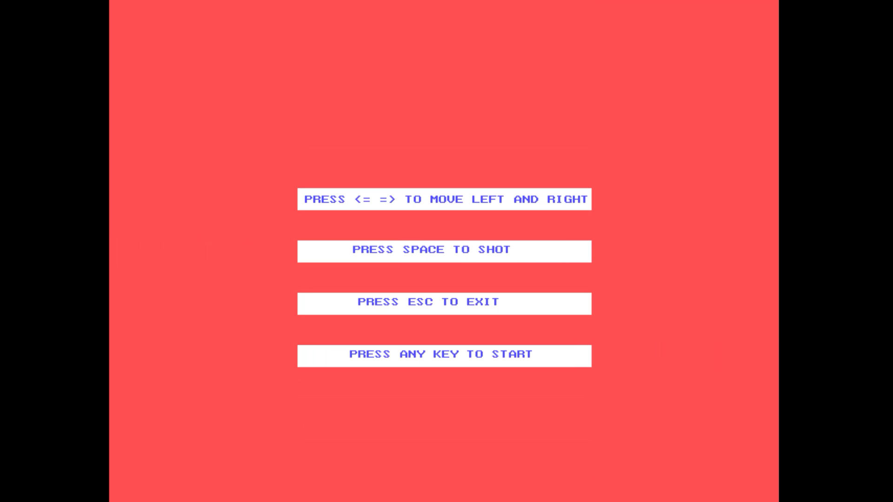
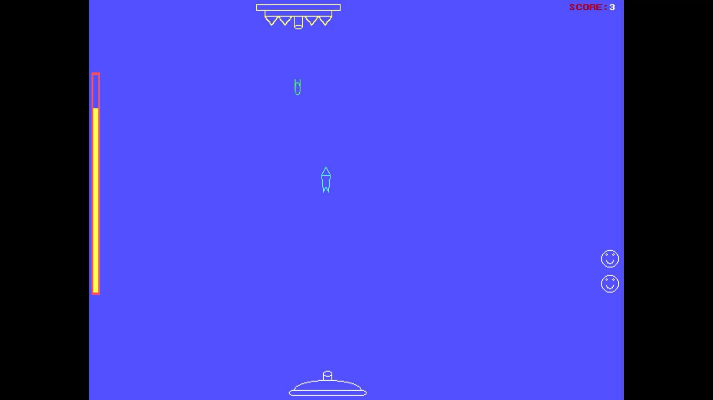
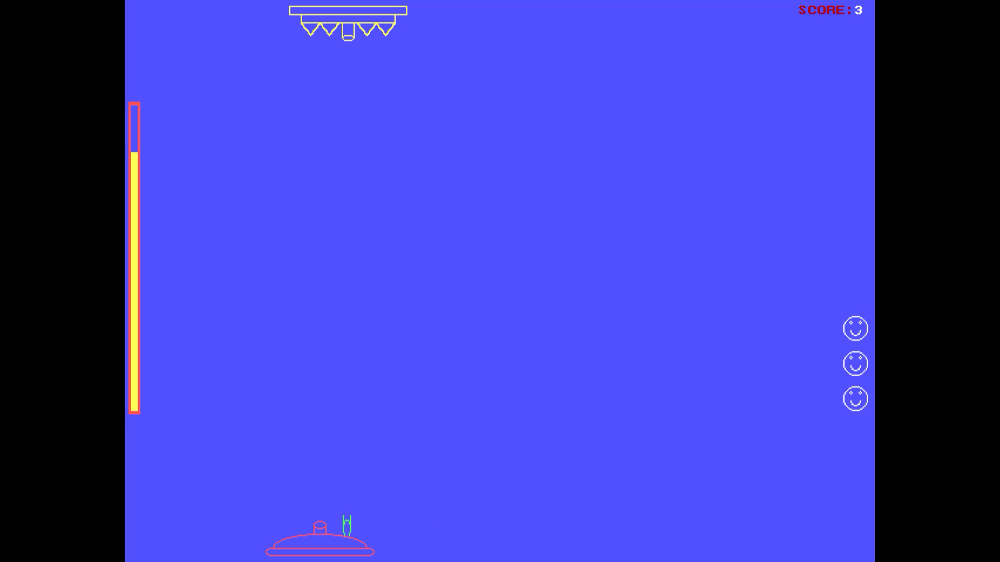
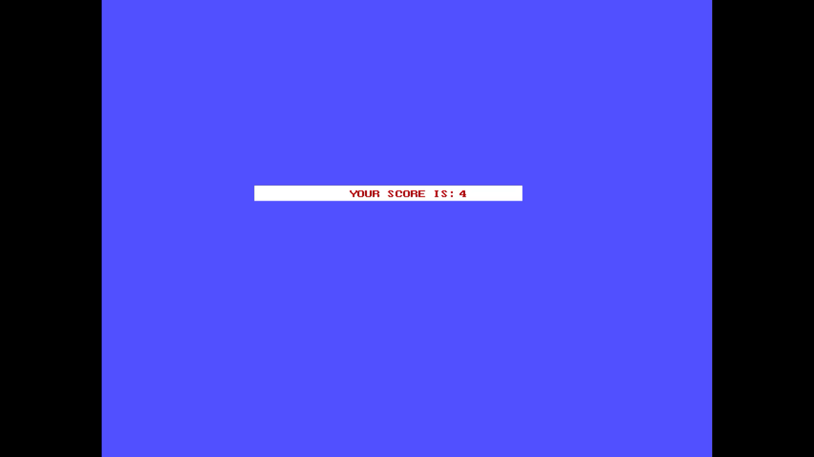
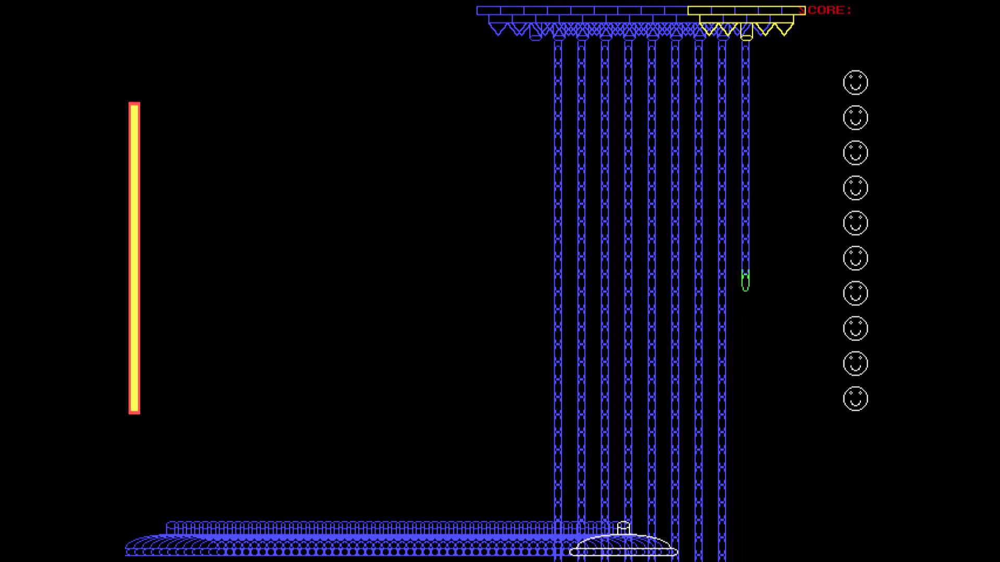
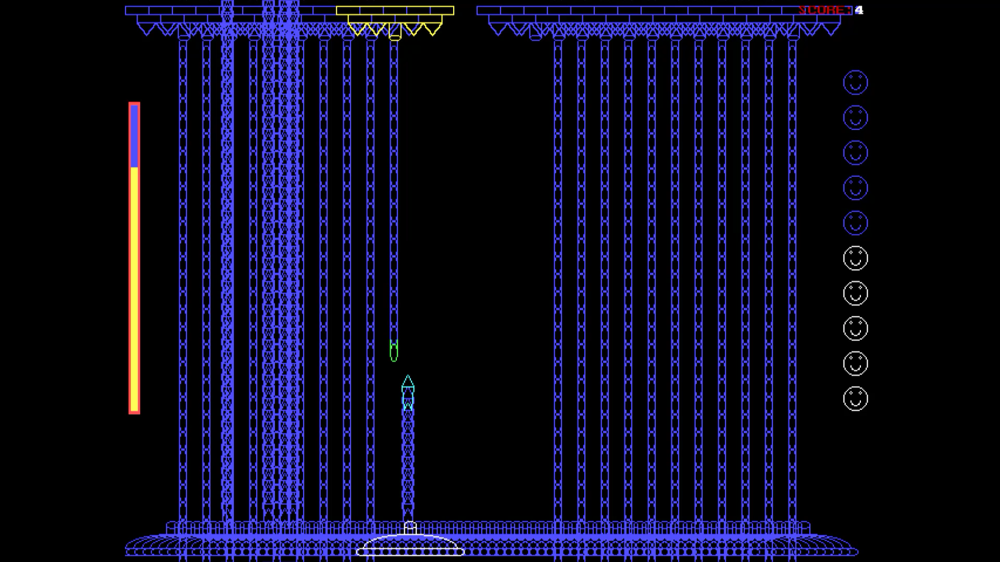
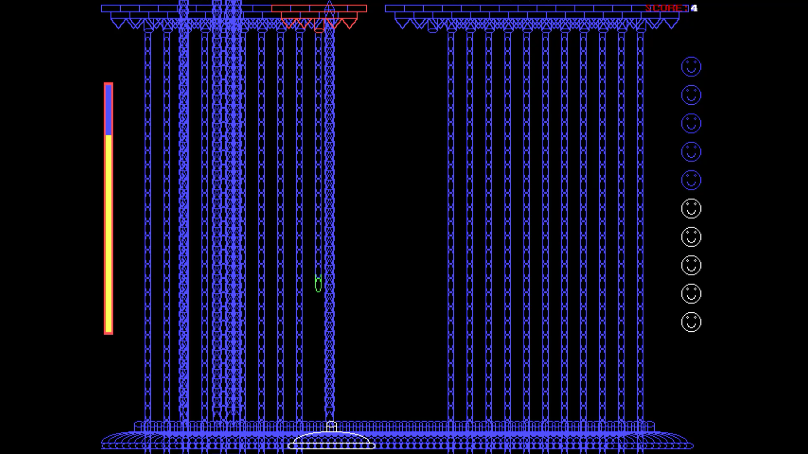
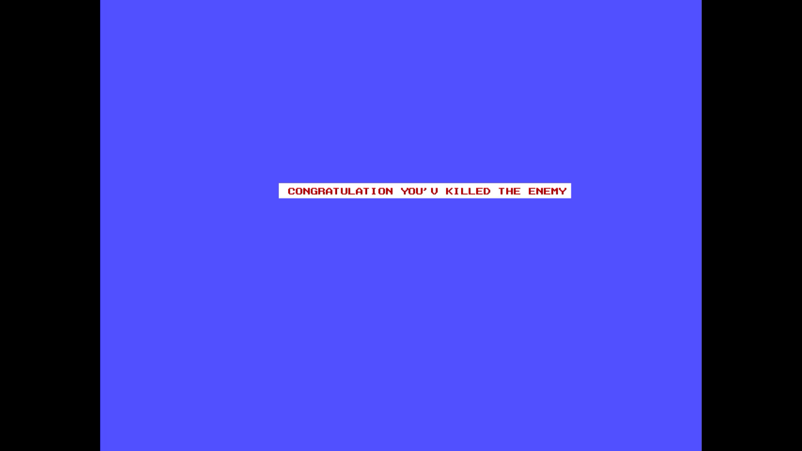

### This Simple game is developed using C programing language (C graphic) , using C graphics for creating games is an old way for game programming like _Super Mario_ and similar games.

# Monster Fighting Youtube video

 
<table style="width:100%" >
    <tr>  
   <th>   <h2></h2> </th>
  <tr/>
  
  <tr>
    <th></th>
  </tr>
  

  <tr>  
   <th>   <h2></h2> </th>
  <tr/>
  <tr>
   <th></th>
  </tr>
  
   <tr>  
   <th>   <h2></h2> </th>
  <tr/>
  
  <tr>
    <th></th>
  </tr>
</table>

   <tr>  
   <th>   <h2></h2> </th>
  <tr/>
  
  <tr>
    <th></th>
  </tr>

   <tr>  
   <th>   <h2></h2> </th>
  <tr/>
  
  <tr>
    <th></th>
  </tr>
  
   <tr>  
   <th>   <h2></h2> </th>
  <tr/>
  
  <tr>
    <th></th>
  </tr>

# What is behind the scenes

   <tr>  
   <th>   <h2></h2> </th>
  <tr/>

   <tr>
    <th></th>
  </tr>
  
   <tr>  
   <th>   <h2></h2> </th>
  <tr/>
  
  <tr>
    <th></th>
  </tr>
  
   <tr>  
   <th>   <h2></h2> </th>
  <tr/>
  
  <tr>
    <th></th>
  </tr>
  
   <tr>  
   <th>   <h2></h2> </th>
  <tr/>
  
  <tr>
    <th></th>
  </tr>

# Short Explanation : 
              
- #### C is not an object oriented programing language and you have to put all source code in one file starting from (void main Function)
- #### The main idea is to draw shapes on the screen using basic shapes functions like circle, rectangle, line, ellipse and dot.
- #### You can control screen background color and shapes color.
- #### You can set text any where on the screen.
- #### Screen dimentions are 640 pixels width and 480 pixels height, you can choose any coordinate around these dimentions to draw any shape. 
- #### Moving shape requires repeating drawing this shape using For loop through a path or a specific points (X and Y) along the screen.
- #### To give the illusion of moving shapes you have to draw the same shape with the same color of the screen background to hide the previous one (as you see in the second part of the video)
- #### You can make any action when pressing buttons like (Enter, Esc, Space, .....)

# Follow Me 
<table>
  <tr>
  <th>
    
    </th>
   
   
   <th>
    
    </th>
    
   <th>
    
   </th>
  </tr>
</table>
